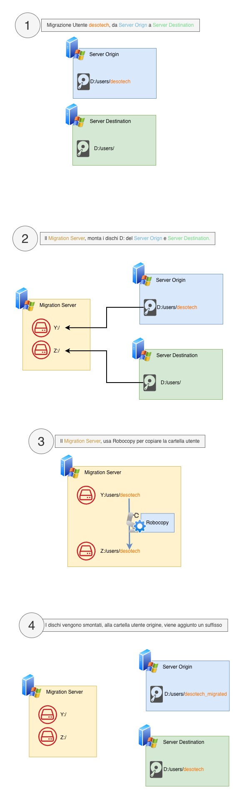

# Strumento di migrazione dei dati

## Introduzione

Questo repository contiene lo script di migrazione nato per automatizzare lo
spostamento della cartella utente Windows da un Server ad un Altro. In pratica
automatizza quelle attività manuali che normalmente richiedono l’accesso a
condivisioni di rete, il montaggio di unità, l’esecuzione di comandi di
copia (`robocopy`) e la verifica dei risultati.  L’intero processo è
configurabile tramite un file di impostazioni e può essere eseguito in
modalità batch o parallelizzata se si desidera ridurre i tempi.

## Fasi della migrazione

1. **Acquisizione delle credenziali** – All’avvio lo script richiede o
   recupera le credenziali da utilizzare per accedere alle condivisioni di
   origine e destinazione.  Le credenziali possono essere fornite
   interattivamente con `Get‑Credential` o recuperate da variabili
   d’ambiente/archivi sicuri come descritto in `credenziali.md`.

2. **Kick session (chiusura sessioni attive)** – Prima di montare le unità di rete, lo script tenta di individuare eventuali sessioni interattive dell’utente sul server di origine (es. RDP/console) e di terminarle. La gestione delle sessioni viene delegata a `kick-session.ps1`, che interroga le sessioni attive e invoca il logoff per ciascuna sessione trovata; se non esistono sessioni attive, lo step viene considerato completato.  In caso di errore o impossibilità nel terminare le sessioni, la migrazione viene interrotta e l’esito viene riportato nei log.

3. **Montaggio dei dischi** – Una volta ottenuti i permessi, lo script
   monta le condivisioni come periferiche di rete.  In PowerShell ciò può
   avvenire tramite `New‑PSDrive` o `net use` per collegare le cartelle
   remote a lettere di unità locali.  Questo passaggio prepara il terreno
   affinché i percorsi sorgente e destinazione siano disponibili per la
   copia.

4. **Copia dei dati con Robocopy** – Con i volumi montati, lo script
   usa **`robocopy`** per eseguire la replica di file e cartelle.  Si
   possono utilizzare parametri quali `/MIR` (mirroring completo) o `/SEC`
   (copia anche dei permessi NTFS) per assicurare che la struttura e i
   permessi dei dati siano preservati.  `robocopy` viene eseguito in
   modalità silenziosa o dettagliata a seconda della configurazione e
   produce log che permettono di verificare lo stato della migrazione.

5. **Pulizia e verifica** – Al termine della copia, lo script analizza i
   log per rilevare eventuali errori o file non copiati e smonta le unità
   di rete.  Eventuali job di copia in background vengono raccolti e i
   log complessivi vengono salvati nel percorso indicato nel file di
   configurazione.

6. **Post Migrazione** - Una volta completata la copia con robocopy (e impostati i permessi NTFS sulla destinazione), migrazione.ps1 avvia uno step aggiuntivo che rinomina la cartella profilo sul server di origine aggiungendo il suffisso _migrated (es. pippo → pippo_migrated).
Questo step viene gestito dallo script post_migrazione_rinomina_sorgente.ps1, che effettua alcuni controlli (esistenza della cartella sulla destinazione, assenza di collisioni sul nome rinominato, ecc.) prima di procedere. Se la cartella risulta già rinominata, lo step viene considerato completato. In caso di errore, la migrazione viene marcata come non completata e l’esito viene riportato nei log.

## Step Migrazione



## Panoramica

Le attività di migrazione vere e proprie sono contenute
nello script `migrazione.ps1`, mentre lo script `dispatcher.ps1` ha il
compito di orchestrare l’esecuzione di più migrazioni in parallelo.  Per
mantenere il codice semplice e riutilizzabile, la logica di mappatura dei
campi, la definizione dei lotti di record e la registrazione dei log sono
state modularizzate.

## Struttura del progetto

* **`migrazione.ps1`** – È lo script principale che esegue la migrazione di un
  insieme di record.  Carica la configurazione dal file `config.psd1`, si
  autentica tramite le credenziali fornite ed esegue i vari passi della
  migrazione: recupera i record dal sistema di origine, esegue la
  trasformazione/mappatura dei campi, invia i dati al sistema di destinazione
  e scrive un log delle operazioni eseguite..

* **`dispatcher.ps1`** – È l’orchestratore che consente di eseguire più
  operazioni di migrazione in parallelo.  Utilizza i **job in background**
  di PowerShell per avviare l’esecuzione di `migrazione.ps1` per diversi utenti
  senza bloccare la sessione principale.  Un job in PowerShell è un
  task che viene eseguito in maniera asincrona: la shell rimane
  disponibile mentre il comando viene eseguito in un processo o thread
  separato.

* **`config.psd1`** – È il file di configurazione in formato **PowerShell
  Data File**.  In questo file vengono definite le variabili utilizzate da
  `migrazione.ps1` e `dispatcher.ps1`, ad esempio:
  
  - URL o endpoint dei server di origine e di destinazione.
  - Numero di record per lotto e numero di job paralleli.
  - Percorsi di file per input e log.

* **`credenziali.md`** – Questo file spiega come fornire le credenziali al
  tool di migrazione senza esporle in chiaro.  È consigliato **non
  hardcodare** nome utente e password direttamente negli script: inserirle
  nei file di codice espone infatti le credenziali a chiunque abbia accesso
  alla repository o al file.

* **`kick-session.ps1`** – Script di supporto invocato automaticamente da `migrazione.ps1` prima del mapping dei drive.  Verifica l’eventuale presenza di sessioni attive dell’utente sul server sorgente e prova a terminarle (logoff).  Può essere usato anche stand-alone per “liberare” un profilo prima della migrazione; produce un log dedicato nella cartella `logs`.

* **`post_migrazione_rinomina_sorgente.ps1`** – Script di post-migrazione invocato automaticamente da migrazione.ps1 al termine della copia. Esegue i controlli di consistenza minimi e rinomina la cartella utente sul server di origine aggiungendo _migrated. Scrive dettagli sul log della migrazione e aggiorna un file di storico comune (vedi sezione “Storico migrazioni”).

## Requisiti

1. **PowerShell**: gli script sono compatibili con Windows PowerShell 5.1 e
   PowerShell 7+.  Verificare che il sistema disponga del modulo
   `Microsoft.PowerShell.Utility`, che include il cmdlet
   `Import‑PowerShellDataFile`.
2. **Permessi di esecuzione**: potrebbe essere necessario eseguire `Set‑ExecutionPolicy` con il valore `RemoteSigned` o `Bypass` per consentire l’esecuzione di script locali.
3. **Connettività di rete**: lo strumento deve poter contattare gli
   endpoint di origine e destinazione.  Se si utilizzano proxy o
   certificati personalizzati, configurare opportunamente le variabili di
   ambiente o aggiornare lo script.
4. **Permessi di amministrazione sul server sorgente**: per interrogare e terminare le sessioni utente è necessario che l’account usato dagli script abbia i diritti per eseguire query e logoff delle sessioni sul server di origine (es. contesto amministrativo/operatore RDS).  Se disponibile, viene usato WinRM/PowerShell Remoting; in alternativa vengono utilizzati i comandi di sistema per query/logoff remoto.

## Come utilizzare lo strumento

1. **Clonare o copiare il repository.**  Tutti i file descritto sopra sono necessari al funzionamento del tool, e devono quindi trovarsi sulla macchina che si occupa di migrare gli utenti.

2. **Preparare il file di configurazione.**  Configurare `config.psd1` con i dati relativi al dominio.

3. **Fornire le credenziali.**  Scegliere uno dei metodi descritti in
   `credenziali.md`.  Ad esempio, creare uno script che legge una password
   criptata o utilizzare `Get‑Credential` all’avvio di `dispatcher.ps1`.

4. **Eseguire la migrazione singola.**  Per eseguire una migrazione su un
   singolo utente o testare il processo, lanciare:
   ```powershell
   pwsh .\migrazione.ps1 -ConfigPath .\config.psd1 -Credential (Get-Credential)
   ```
   Dove `-ConfigPath` indica il percorso del file di configurazione e
   `-Credential` accetta un oggetto `PSCredential`.  Lo script stamperà a
   schermo lo stato delle operazioni e scriverà il log sul percorso
   configurato.

5. **Eseguire la migrazione completa.**  Per sfruttare l’esecuzione
   parallela e migrare grandi volumi di utenti, utilizzare `dispatcher.ps1`:
   ```powershell
   pwsh .\dispatcher.ps1 -ConfigPath .\config.psd1 -Credential (Get-Credential)
   ```

6. **Monitorare l’esecuzione.**  Durante la migrazione si possono usare i log che vengono scritti, oppure usare i
   cmdlet `Get‑Job`, `Receive‑Job` e `Wait‑Job` per monitorare e
   interagire con i job in background.  Ad
   esempio:
   ```powershell
   Get-Job
   Receive-Job -Id 3
   Wait-Job -Id 3
   ```
   Alla fine della migrazione, `dispatcher.ps1` rimuove i job terminati.

7. **(Opzionale) Terminare manualmente le sessioni di un utente.**  Se servisse “liberare” un profilo prima di avviare la migrazione (o in caso di retry), è possibile eseguire lo script di kick in modo indipendente:

   ```powershell
   pwsh .\kick-session.ps1 -User pippo -Source SRV-SORGENTE
   ```

